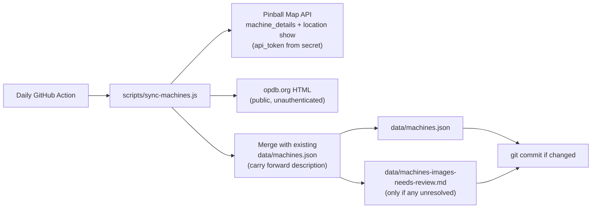

# Sync `data/machines.json` from Pinball Map

## Prerequisite (blocking — do this first)

Pinball Map now requires a manually-approved `api_token` on every API call (enforced since July 30, 2026). **No script will be written to actually run against the live API until you have this token.** See the step-by-step instructions above this plan for how to request it, and store it as a GitHub Actions secret named `PINBALLMAP_API_TOKEN`. Everything below is designed so implementation can start immediately once that secret exists — I will not commit anything that hardcodes or requires the token to be present in this repo.

## Architecture (mirrors the existing drinks pipeline)



Unlike `js/drink-menu.js`, the browser will **not** call Pinball Map/OPDB directly — both APIs forbid exposing tokens client-side, and the OPDB scrape is multi-request/slow. `js/machine-card.js` keeps doing exactly what it does today: `fetch("../data/machines.json")`. No changes needed there or in `js/pages/machines.js` — both already treat `badge`/`description` as optional.

## Pinball Map endpoint (one location's machines)

Source of truth for the API surface is [pinballmap.com/llms.txt](https://pinballmap.com/llms.txt) (last updated 2026-08-06).

**The script hits these two endpoints** (both for location `30142` only — still well under Pinball Map's "fewer than 10 calls" guideline):

```
GET https://pinballmap.com/api/v1/locations/30142/machine_details.json?api_token=$PINBALLMAP_API_TOKEN
GET https://pinballmap.com/api/v1/locations/30142.json?api_token=$PINBALLMAP_API_TOKEN
```

`machine_details.json` is the dedicated "machines at this location" call. The JSON is a `machines` array of full catalog records (`name`, `manufacturer`, `year`, `opdb_id`, `opdb_img`, `ipdb_id`, `ipdb_link`, `is_active`, plus a catalog-level `created_at` that we **must not** treat as date-added).

`locations/30142.json` is the location show endpoint. Its default payload includes the venue's **location_machine_xrefs (LMXs)** — one record per machine *installed at this venue*. Each LMX has its own `created_at` (example: `"2023-05-07T16:57:26.948-07:00"`), which is when that machine was listed at The Getaway on Pinball Map. Join to `machine_details` by `machine.id` / LMX `machine_id`.

**Date-added field we store:** `pinballMapDateAdded` — ISO date (`YYYY-MM-DD`) taken from the matching LMX `created_at`. Not shown in the UI yet; extra JSON fields are ignored by `js/machine-card.js`.

**What this date is / is not:**
- It is "first listed at this location on Pinball Map."
- It is **not** physical arrival at the arcade, and **not** when the title was added to Pinball Map's global catalog (`Machine.created_at` on `machine_details.json` is that catalog date — do not use it).
- If a machine is removed from the listing and later re-added, LMX `created_at` resets to the re-add.

**Why not the other endpoints:**

- `GET /api/v1/locations.json?by_location_id=30142` is the bulk location index filtered to one venue. Do not use it; the two calls above already cover roster + LMX dates.
- `GET /api/v1/machines.json` is the **global** catalog of every machine in Pinball Map, not "what's on the floor here." Do not call it.
- Do **not** loop `GET /api/v1/location_machine_xrefs/:id.json` per machine — that's the N+1 anti-pattern Pinball Map forbids. The location show endpoint already returns all LMXs in one response.

Per Pinball Map's request-volume rules: two scheduled fetches of this single location, cache the result in `data/machines.json`, never call the API from a visitor's browser or per pageview.

## `scripts/sync-machines.js` (new, Node, no dependencies — matches `sync-drinks.js` style)

1. **Fetch the lineup** from both endpoints above in parallel (token read from `process.env.PINBALLMAP_API_TOKEN`; hard-fail with a clear message if unset — never hardcoded). Filter out `machine_details` entries with `is_active === false`.
2. **Map core fields** from the Machine schema plus the matching LMX:
   - `id`: deterministic slugify of `name` (strip `()`/`:`, lowercase, hyphenate) — matches existing ids like `black-knight-sword-of-rage-pro`.
   - `manufacturerSlug`: small lookup table (`Stern`/`Stern Pinball` → `stern`, `Williams` → `williams`, `Bally` → `bally`, etc.) with a generic slugify fallback for anything unlisted (falls into the existing "Others" filter pill automatically, per the comment in `js/machine-card.js`).
   - `year`: passed through.
   - `pinballMapDateAdded`: ISO date from LMX `created_at` (see endpoint section). Omit the field if no matching LMX is found.
   - Keep `opdbId` / `ipdbLink` in the output JSON (extra fields the renderer ignores) — needed as the merge key and useful for manual debugging/citations.
3. **Resolve the image, deterministically, no AI**:
   - Skip entirely if PM gave no `opdb_id`.
   - Fetch `https://opdb.org/machines/{opdb_id-resolved-numeric-page}/images` — resolved via `https://opdb.org/search?q={opdb_id}`, which 302-redirects straight to the canonical machine page (confirmed live against Aerosmith's `opdb_id`).
   - Parse the `<h5>Backglass/translite (N)</h5>` section (plain regex/string parsing, confirmed this grouping exists on OPDB's public, unauthenticated HTML).
     - `N === 1`: use it (convert the thumbnail's `-small.jpg` URL to `-large.jpg`, matching the convention already in `data/machines.json`).
     - `N === 0`: unresolved.
     - `N > 1`: fetch each candidate's caption (`<div class="card-header">…</div>`); if exactly one caption contains the machine's edition keyword (Pro/Premium/LE/etc.), use it; otherwise unresolved (this is the shared-"family"-page case, e.g. Godzilla 70th Anniversary, where OPDB's captions genuinely don't disambiguate and a human would need to look at the photo — confirmed live).
   - Add a short delay between requests and a descriptive `User-Agent` (courteous; `opdb.org/robots.txt` fully allows fetching, and this only runs once a day for ~20-30 machines).
   - Every unresolved machine gets no `image` field and is added to a generated `data/machines-images-needs-review.md` (same spirit as the existing `data/machines-new-arrivals-SOURCES.md`, listing each candidate photo URL found so a human can finish the call quickly).
4. **Merge with the current file** to avoid losing hand-written content: build a lookup from the existing `data/machines.json` keyed by `opdbId` (fallback: normalized `name`+`manufacturer`+`year`), and carry forward `description` for matches. `badge` is dropped from the schema entirely (per your call — it can't be derived deterministically and isn't worth faking).
5. **Sort** alphabetically by name (stable diffs) and write `data/machines.json` only if content changed (idempotent, same pattern as `sync-drinks.js`).

## `.github/workflows/sync-machines.yml` (new)

Same shape as `.github/workflows/sync-drinks.yml`: `schedule` (daily cron) + `workflow_dispatch`, `PINBALLMAP_API_TOKEN` passed from `secrets.PINBALLMAP_API_TOKEN` as an env var to the script, then commit-if-changed on both `data/machines.json` and `data/machines-images-needs-review.md`.

## `package.json`

Add `"sync-machines": "node scripts/sync-machines.js"`.

## Documentation

- New `data/machines-SOURCES.md` explaining the ongoing methodology (Pinball Map for the roster, OPDB's public HTML for images, the review-file fallback) — supersedes the one-time `data/machines-new-arrivals-SOURCES.md`, which stays as historical record of how the current 23 entries were originally seeded.

## Small site change (data-use-agreement attribution)

Pinball Map's terms require attributing the specific location shown. Add a small credit line/link to `machines/index.html` (e.g. near the footer of the machine grid) pointing to `https://pinballmap.com/map/?by_location_id=30142`.

## Open items / things you may want to revisit later (not blocking)

- `data/machines-BACKUP.json` and `data/machines-skeleton.json` look like stale scratch files (an old mockup and a backup with one stray diff already sitting in your working tree). Not touched by this plan — flagging in case you want them cleaned up separately.
- Kineticist has a promising images API as a possible 3rd image source, but requires yet another account/API key signup — left out of scope; can add later if OPDB's coverage proves insufficient once you see the real review-file output.
- New machines discovered by the sync that aren't in the current file will have no `description`; writing those blurbs is a separate, manual/editorial task outside this deterministic script.
